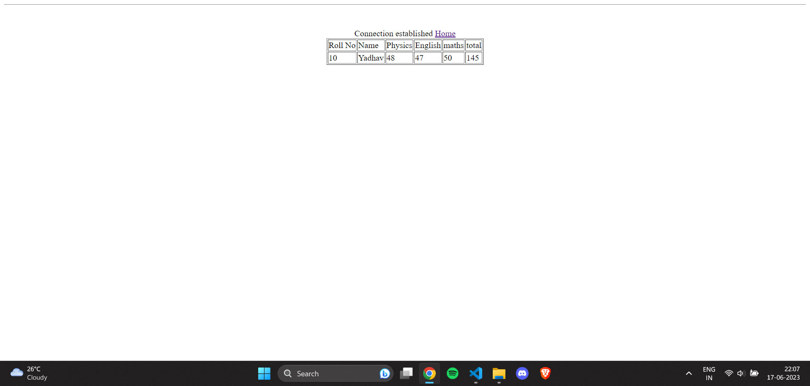

# Marklist
A basic Marklist Management Application that performs CRUD operations.
 
 
The database contains rollno, name, marks of various subjects(3), total marks.
 
I used wamp server for the opertions.
 
 
<h3>Screenshots of the Results:</h3> 
 
 

 
 

 
 

 
 

 

 
 

 
 
